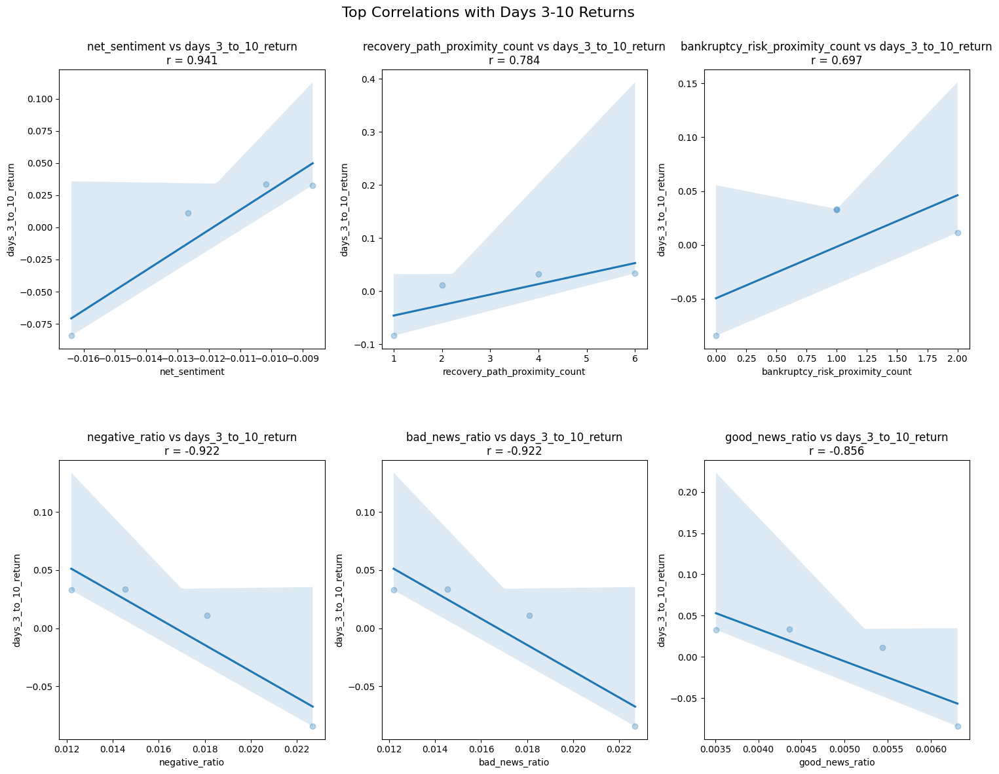

## About Me
**Lehigh University Class of 2025**
 
Integrated Business and Engineering Honors Program
 
Industrial and Systems Engineering
 
Finance Double Major
 
Data Science Minor
 

  
  
    <a href="https://ibe.lehigh.edu/welcome-lehighs-ibe-honors-program">
      <strong><em>Read About Lehigh's Integrated Business and Engineering (IBE) Honors Program</em></strong>
    </a>
  

---

## Career Objectives

I am passionate about the Financial Services Sector. Constantly looking to apply technical mathemtatics through data science methods in multidisciplinary projects throughout my academic and personal endeavors. Ultimately a curious thinker and problem solver.

---

## Portfolio

<!-- You can link to other websites, PDFs in this repo, and other pages in this repo -->

_**[Financial Engineering - Natural Language Processing 10-Ks to Identify Risk](report.md)**_

<!-- You can show off your midterm analysis by moving the report components and output into this file. Or... -->
Using data dictionaries and word sentiment ratings along with financial topic word compilations, the 10-k documents for the S&P 500 firms were scraped and compared to returns around the day of the 10-k filing date to identify correlation metrics between document sentiment variables and stock returns.

    

---

_**[Financial Engineering - Bert and ChronoBert Time Series Analysis using Pairs Trading](https://donbowen.github.io/teamproject/)**_

<!--  -->

---

_**[Data Science - Formula 1 Race Predictions](main)**_

Using historical Formula 1 data, I created a Machine Learning model using Random Forest to predict outcomes of Formula 1 races.

<!--  -->

---
_**[Financial Optimization - ](main)**_

Insert Project description here...

<!--  -->

---

