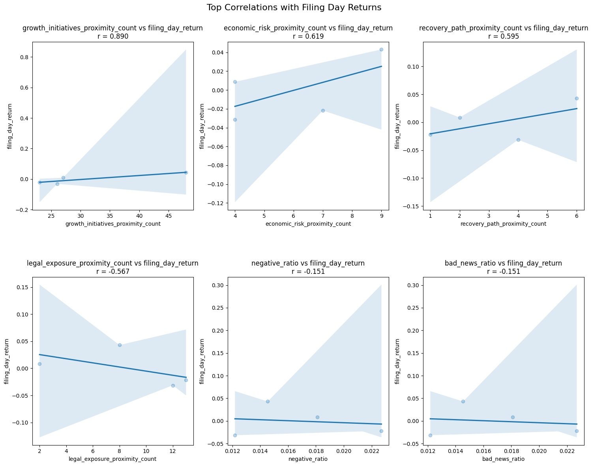
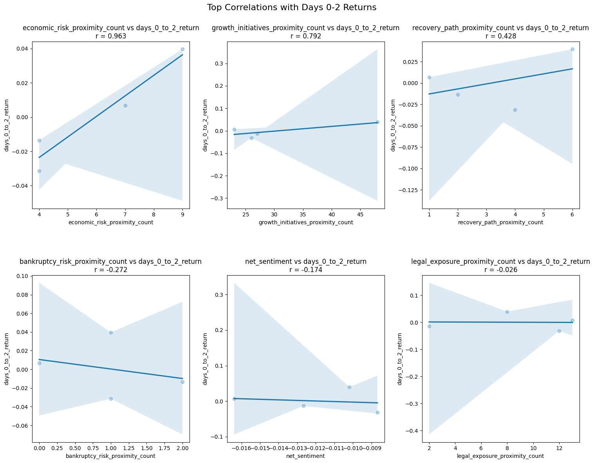

**Top Correlations on Filing Day Returns**

    

This figure displays the sentiment variables with the highest correlations to returns on the day the 10-K was filed.

The graph visualizes individual sentiment variables (x-axis) against same-day returns (y-axis). One key insight is the slope of the trend lines, which may provide predictive value on how certain sentiment indicators align with immediate market reactions.

---

**Top Correlations from Day 0 to Day 2 After Filing**

    

This figure presents the strongest correlations between sentiment variables and stock returns over the 0–2 day window post-filing.

As with the prior figure, sentiment variables are on the x-axis and corresponding returns on the y-axis. In this window, **Economic Risk Proximity** has the highest correlation, followed by **Growth Initiatives Proximity** and **Recovery Path Proximity**. This broader time frame captures delayed investor reactions to specific disclosures in the filings.

---

**Top Correlations from Day 3 to Day 10 After Filing**

    

This figure highlights the top correlations between sentiment measures and returns 3–10 days after the 10-K filing.

This longer-term view reveals that **overall sentiment**, as opposed to topic-specific variables—, xhibits stronger correlations with stock performance. This may suggest that the broader tone of the filing has a sustained influence on investor expectations and market valuation.
